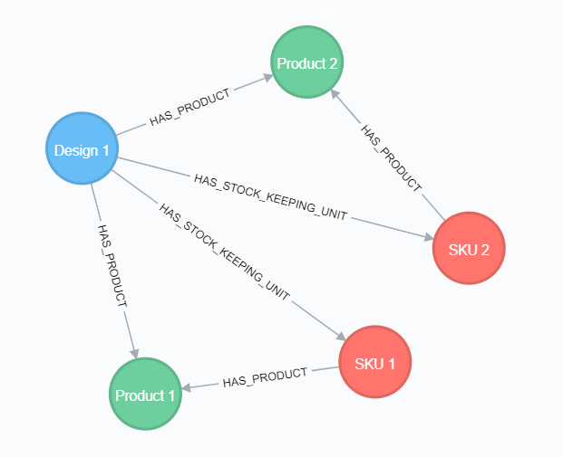
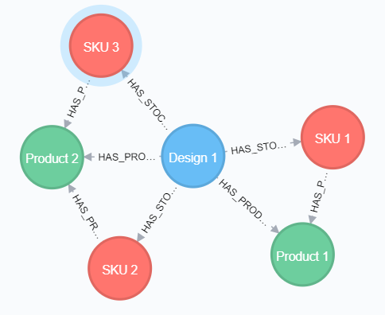
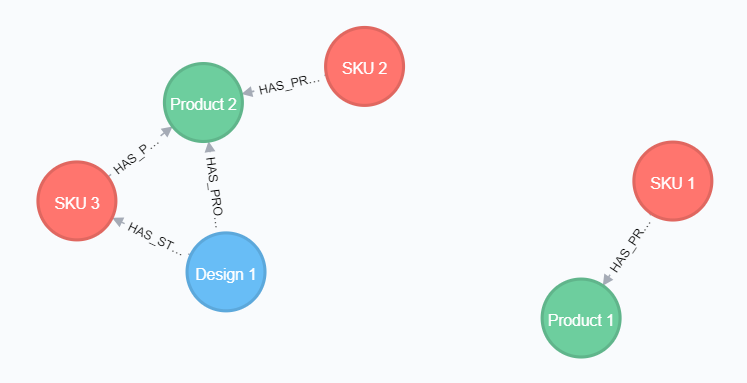

# neo4j-ogm-issue

## Introduction

Upgrading from Spring Boot 2.0.8 to 2.3.11 (Spring Data Neo4j 5.0.13 to 5.3.9, Neo4j OGM 3.1.6 to 3.2.23) results in changed behavior when using Jackson `ObjectIdResolver`s to resolve related entities from id incoming requests to a rest controller.

## Scenario

In a REST API with CRUD operations for entities, Jackson `ObjectIdResolver`s are used to resolve related entities from id's in the incoming JSON request. The entities have a custom id field of type UUID, and the resolvers use Neo4j repositories to lookup the entities by the UUID key.

In this sample project, there are 3 entities - A `Design` has `Product`s and a product has `StockKeepingUnit`s.

The sample data is a design with 2 products, with one stock keeping unit each.



## Problem

POST to create a new stock keeping unit:

```http request
POST http://localhost:8090/designs/2e3e61eb-7725-4c0a-93be-219c8961ad92/stock-keeping-units
Content-Type: application/json

{
  "name": "SKU 3",
  "product": "49606e88-9509-4cae-86fd-1f6c70788b95"
}
```

The product id in the request is resolved to a product entity by the `ProductResolver` before the rest controller is invoked. The resolved product entity (in this case `Product 2`) has a reference to `Design 1` and `SKU 2`. The relations of the design are however not loaded, since the product was loaded with default horizon 1.

Next, the rest controller looks up the design by id, and here is where the result differs between versions.

With Neo4j OGM 3.1.6, the instance from the resolver will be equal to the instance from the lookup. This means that the design entity that was partially loaded by the resolver will now be fully initialized with a complete list of product. It does not matter which reference is used, both `design` and `stockKeepingUnit.getProduct().getDesign()` refer to the same instance. After connecting the stock keeping unit with the design from the lookup and saving the stock keeping unit, the database looks like this:



With Neo4j OGM 3.2.23, the instance from the resolver and the instance from the lookup will not be equal. The instance from the resolver is only partially initialized and does not have a full list of products - it only has a reference to `Product 2` which happens to be in context. After connecting and saving the stock keeping unit, the database looks like this: 



`Product 1` has now been decoupled from `Design 1`, which is not the expected result.

## Steps to Reproduce

1. Deploy Neo4j to Docker using `docker-compose.yaml`.
2. Start the `OgmSampleApplication`. Liquigraph will insert the sample data.
3. POST to create a new stock keeping unit

    ```http request
    POST http://localhost:8090/designs/2e3e61eb-7725-4c0a-93be-219c8961ad92/stock-keeping-units
    Content-Type: application/json
    
    {
      "name": "SKU 3",
      "product": "49606e88-9509-4cae-86fd-1f6c70788b95"
    }
    ```